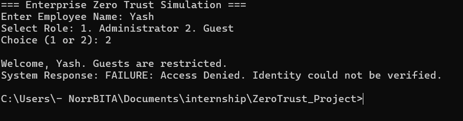

# Minor Project 2: Zero Trust Architecture for Enterprise Security

### Project Overview
This project simulates a Zero Trust security framework, moving away from the traditional "perimeter-based" security model to a "Never Trust, Always Verify" approach. It ensures that every access request is authenticated and authorized based on identity and predefined roles.

This implementation satisfies the requirements for my cybersecurity internship, focusing on Identity & Access Management (IAM) and network micro-segmentation.

### Key Features
* **Role-Based Access Control (RBAC):** Access is strictly managed based on user roles (Administrator vs. Guest).
* **MFA Simulation:** A security token handshake is required to unlock sensitive data.
* **Micro-segmentation:** The backend `database_system.py` is isolated from the `enterprise_portal.py`, simulating a segmented corporate environment.

### System Architecture
The project is split into two Python-based services to simulate a segmented network:
1.  `database_system.py`  : This acts as the isolated "Secure Zone." It holds sensitive data and requires a valid token for every request.
2.  `enterprise_portal.py`: This is the "Public Zone" where users log in. It enforces the access policies before attempting to communicate with the database.

### How to Run the Simulation
1.  Ensure Python 3.13 or higher is installed.
2.  Place both `database_system.py` and `enterprise_portal.py` in the same directory.
3.  Open the Command Prompt, navigate to the folder, and run:
    python enterprise_portal.py

### Technical Simulation Results
The effectiveness of the Zero Trust model was verified through two primary test scenarios:

#### **Test 1: Authorized Administrator Access**
In this scenario, the user logs in as an Administrator. The system verifies the role, generates the necessary MFA token, and successfully retrieves data from the vault.

#### **Test 2: Unauthorized Guest Access (Security Enforcement)**
In this scenario, a Guest user attempts to access the vault. The RBAC policy identifies the restricted role and denies the token generation, successfully blocking the access attempt.

